## Upplägg

### Vad vill vi veta om bistånd och demokratisering?

- **Del 1** Vad är demokratibistånd?

- **Del 2** Fungerar demokratibistånd?

- *15 min paus*

- **Del 3** Bistånd från auktoritära regimer

--

**Frågor är varmt välkomna!**
---

## Var passar bistånd in i kursen? 

### Variabler som potentiellt påverkar demokratisering:

 |Domestic|International
---|---|---
**Macro**|Economic development|Economic dependence
 |Class structure| Free trade
 |Social cleavages|Colonial legacies
 |Economic Performance|Overseas Development Assistance
---|---|---
**Micro**|Elite pacts|Diffusion of norms
 |Individual values|Pressure from IOs
 |Institutional incentives|**Democracy assistance**

---

## Vad är demokratibistånd?

Tre huvudsakliga delområden:
- Val och politiska partier (contestation)

- Reformera statliga institutioner (horisontellt ansvarsutkrävande)

- Civilsamhällsstöd (vertikalt ansvarsutkrävande)

--

Mål: 

-"to foster and advance democratization"

-"foster democratic citizens"

--

Kom ihåg: Vad som räknas som demokratibistånd beror på hur man definierar demokrati samt på antaganden om vad som verkligen främjar demokrati (ex fackföreningar).

---

## Demokratibistånd över tid
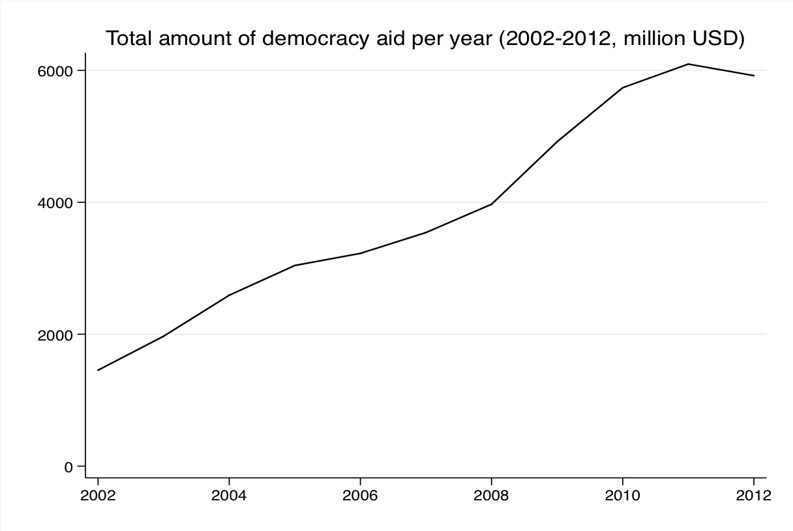

---

## Demokratibistånd över tid

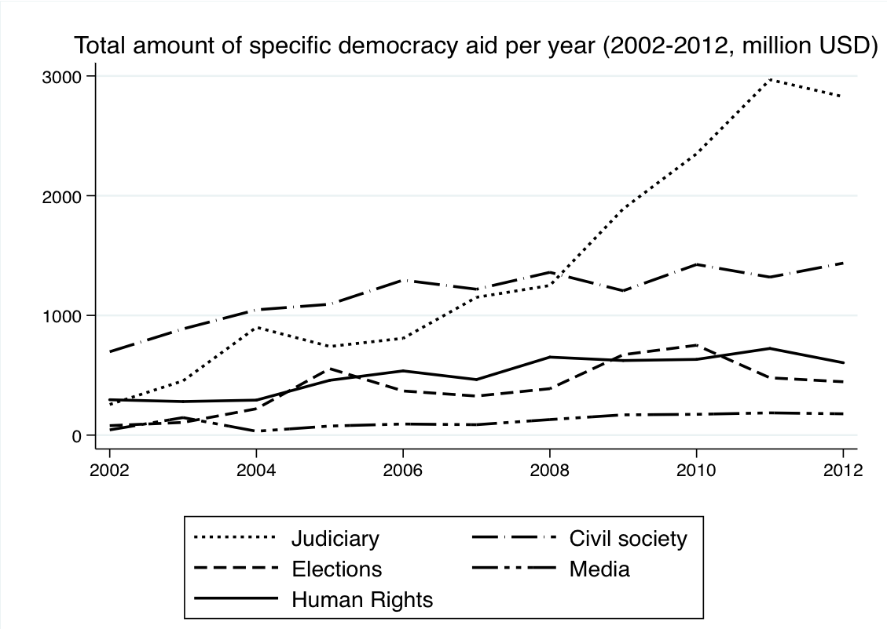

---

## Vilka typer av länder får demokratibistånd? 

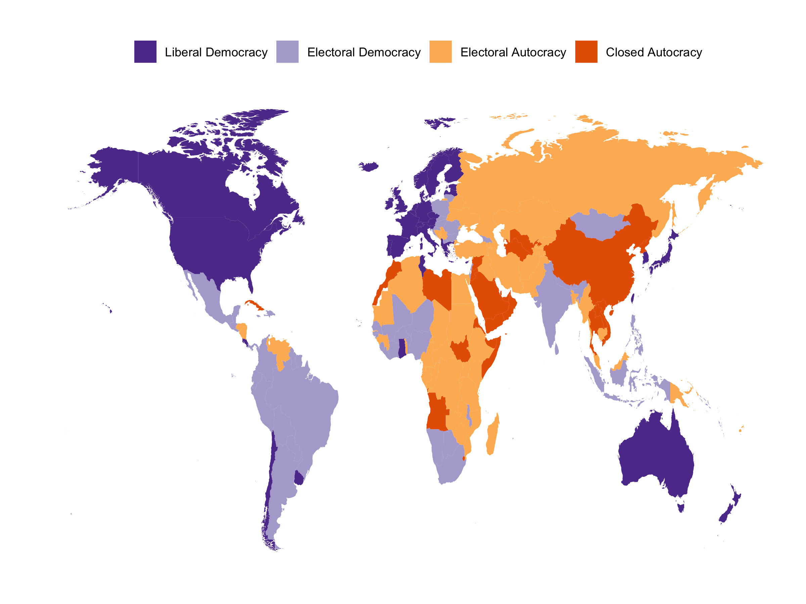

---

## Vilka typer av länder får demokratibistånd?

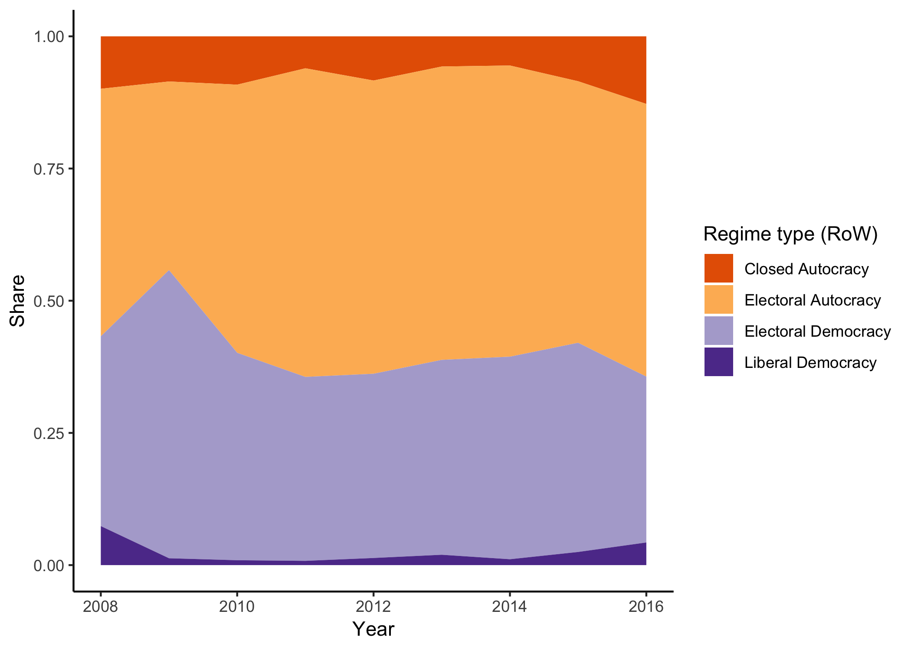

---
## Kompisövning 1

### Vilka länder har fått mest demokratibistånd de senaste 10 åren?  

---

## Allokering av demokratibistånd 2008-18
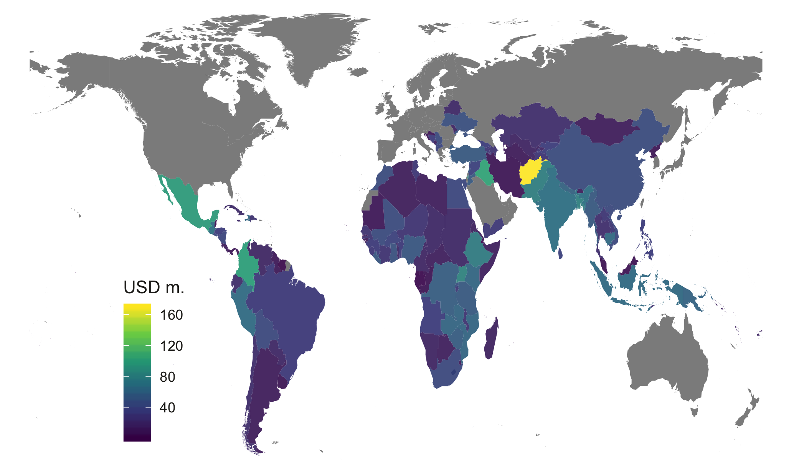

---

## Trender och utmaningar (Carothers 2015)

Historiskt: 
- 70 tal demokratisering i södra Europa. Spanien, Portugal.
- 80 tal stöd i kampen mot apartheid samt reformer i Östeuropa. Överskuggades av kalla kriget och strategiska intressen.

Trender:
- Mer bottom-up projekt
- Kontextuellt bistånd
- Civilsamhällsorganisationer

Utmaningar:
- Stärka auktoritära institutioner (ledare)
- Motsättningar i biståndsstrategier (bottom up vs. top down)
- Korruption
- "The taming of democracy assistance" (Sarah Bush)

--

Sweden remains alone among major donor countries in embracing Amrtya Sen's notion of "Development as Freedom"

---

## Utsikterna för demokratibistånd 1990

- Utökning av demokratier
- Öppna dörrar efter kalla kriget
- Avsaknad av ideologiska rivaler  

--

### Men sedan 2000...

- Demokratisk stagnation (backsliding i Afghanistan, Iraq, Mali, etc)

- Stängda dörrar
  - Förbud mot utländskt bistånd till civilsamhälles organisationer (Ryssland, Ungern)
  
- Alternativa modeller: Kina, Etiopien, Ryssland

--

- Trumps "America First Policy"

--

Kan inte längre anta att demokrati är önskvärt.

---

## Kompisövning 2

### Bör vi ge demokratibistånd till andra länder?

---

## Kompisövning 2 - eventuella invändningar:

- Rätten till självbestämmande och suveränitet: bör länder själva få välja om de vill ha demokrati/demokratibistånd?

- Riskerar att vara etno-centriskt: västländer exporterar modeller som inte passar alla?

- Drivs i själva verket av egenintresse? Öppna marknader mm. 

- Om opinionen i givarländer inte vill ge bistånd bör skattepengar användas till detta?

---

## Kan slå bakut - ex valobservatörer

Observation på valdagen:

- Missar valkampanjen
- Förutsättningarna för ett fritt och rättvist val

Utmaningar:

- Legitimerar auktoritära val
  - Internationellt
  - På hemmaplan
- Autocratic evolution (ex. Cambodia, Cameroon)

---

## Del 2: Fungerar demokratibistånd?

### Finkel, Perez-Linan and Seligson (2007)
- Tidsperiod 1990-2003
- Från 128 to 813 millioner USD 
- 165 länder
- Sepparera demokratibistånd från övrigt bistånd
- Bara USAIDs demokratibistånd

Resultat: “investment of one million dollar (…) would foster an increase of democracy 65 percent greater than the change expected for the average country in the sample”

---

## Finkel et. al. (2018)
- Uppdatering med V-Dem data

- Tidsperiod 2001-2014

- [Länk](läggtilllänkhär)

---

## Svårigheter med att veta om demokratibistånd har någon inverkan:

- Otroligt mycket påverkar demokratisering, kan inte kontrollera för allt

- Ett land kan få mer bistånd när det går sämre 

- Eller när det går bättre

---

# Del 3 Auktoritärt bistånd

---

## Autokrati-bistånd?

"Nya" biståndsgivare:
- Kina
- Ryssland
- Iran
- UAE
- Saudiarabien
- Venezuela (inte senaste åren)
- Qatar
- Rwanda
- Etiopien

--

Inte autokrati-bistånd, men inte heller demokratiskt

---

# Kompisövning 3

## Hur kan auktoritärt bistånd motverka demokrati?

---

## Potentiella mekanismer 

Hur kan auktoritärt bistånd underminera demokratisering?
- Förhandlingsutrymme - Conditionality? "Tack, men nej tack!"

--

- Authoritarian learning - delar med sig av kunskap/kontroll

--

- Hearts and minds - opinionsskifte

--

- Ökad korruption - hinder för demokrati?

---

# Kina en ny och annorlunda givare

- Ingen biståndsmyndighet (håller på att etablera en)

- Ingen upphandling: isolerat bistånd

- Biståndsdata anses som en statshemlighet

--

- AidData TUFT (Tracking Underreported Financial Flows)

---

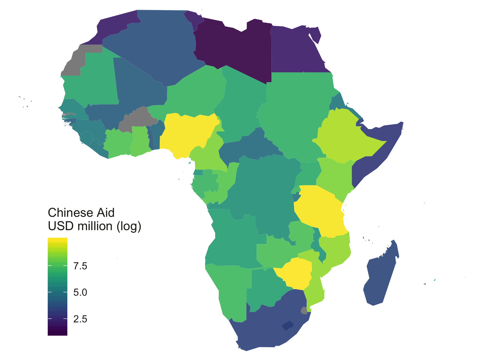

---
## Vem får auktoritärt bistånd?

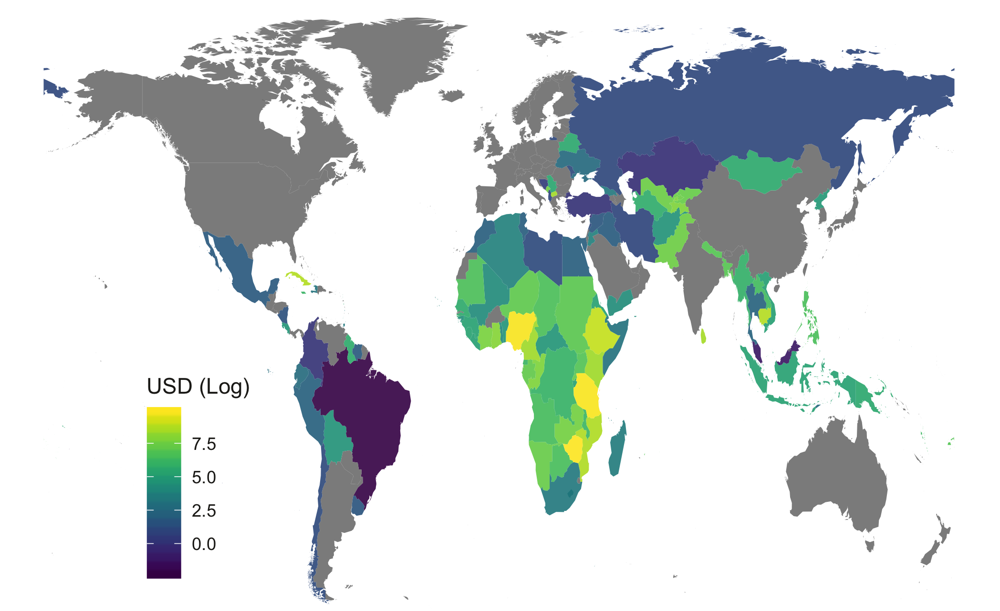

---

## Kinas bistånd till olika regimtyper över tid

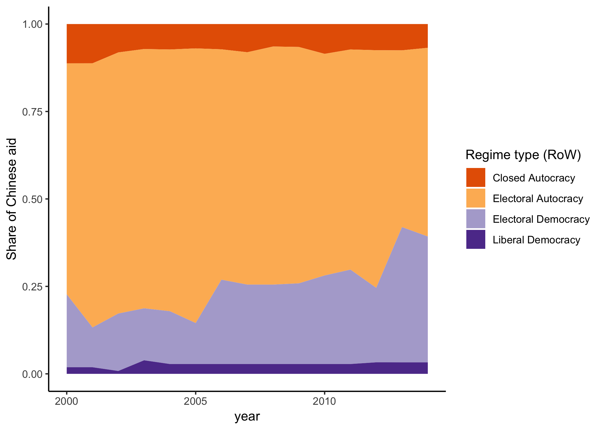

---

## Vem får auktoritärt bistånd?

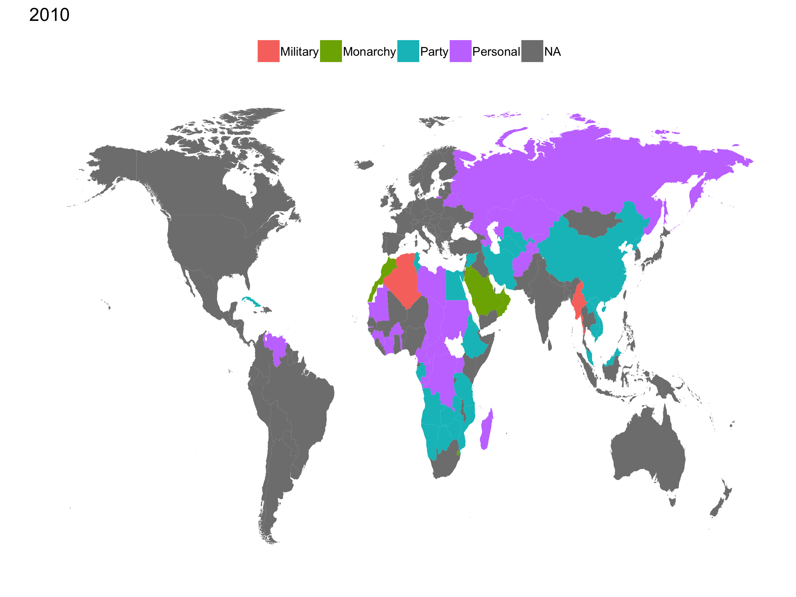

---

## Kinas bistånd till olika regimtyper över tid - Party!

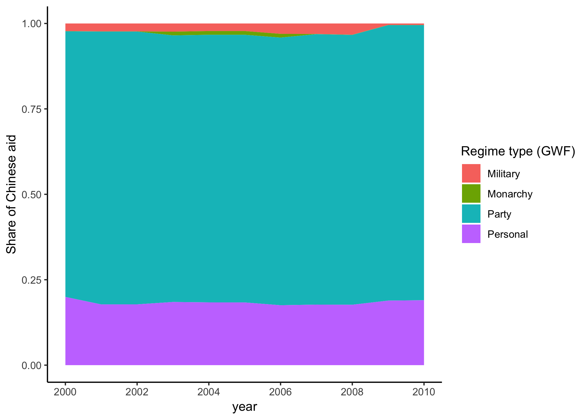

---

## Does conditionality still work? - Li (2017)

- Conditionality fungerar enbart när länder inte har tillgång till kapital från alternativa givare

- Fönstret som öppnades efter kalla krigets slut är nu stängt

- Detta är inte nödvändigtvis dåligt - donor competition

---

## Does conditionality still work? - Li (2017)

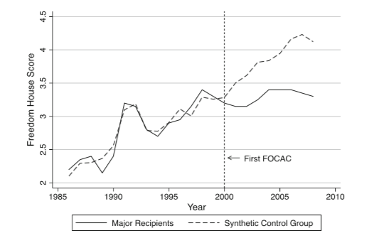

---

## Are “New” Donors Challenging World Bank Conditionality? Hernandez (2017)

- Världsbanken kräver färre conditionalities till mottagarländers som också har tillgång till Kinesiskt kapital

- Mindre krävande lånevillkor (ränta/återbetalningstid) för mottagarländer som också har kapital från Kuwait och the UAE

- Men ingen skillnad om länder har tillgång till kapital från demokratiska givare

---

## Rouge aid - dominerande narrativ i media

- Korruption 

- Dålig kvalitet

- Tar in kinesisk arbetskraft

- Dept trap diplomacy

- Credit claiming

- Taskig av fingertoppskänsla 

---

## Taskig fingertoppskänsla:

---

## Men det gäller inte bara auktoritära givare: 

---

## Top-down styrning - aid on demand

Tack för det fina operahuset men:

--

- “We have to start with the first step and get a job for unemployed local youth. A factory would have been a better present.

--

- Påtvingad folkförflyttning till följd av infrastrukturprojekt 

--

- Politiskt styrt bistånd (ex Sri Lanka)

---

## Aid on demand - Dreher et al. (2016)

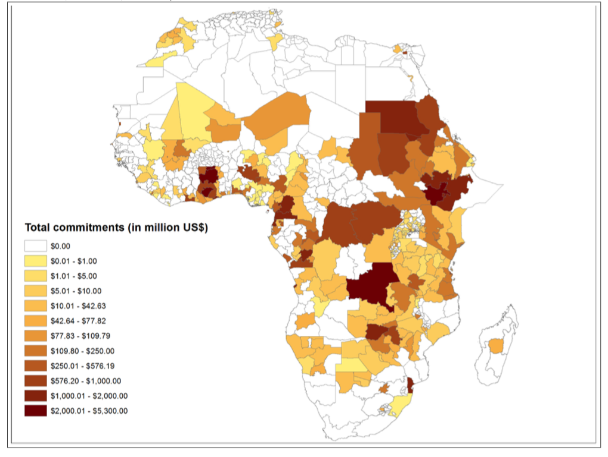

---

## Aid on demand - Dreher et al. (2016)

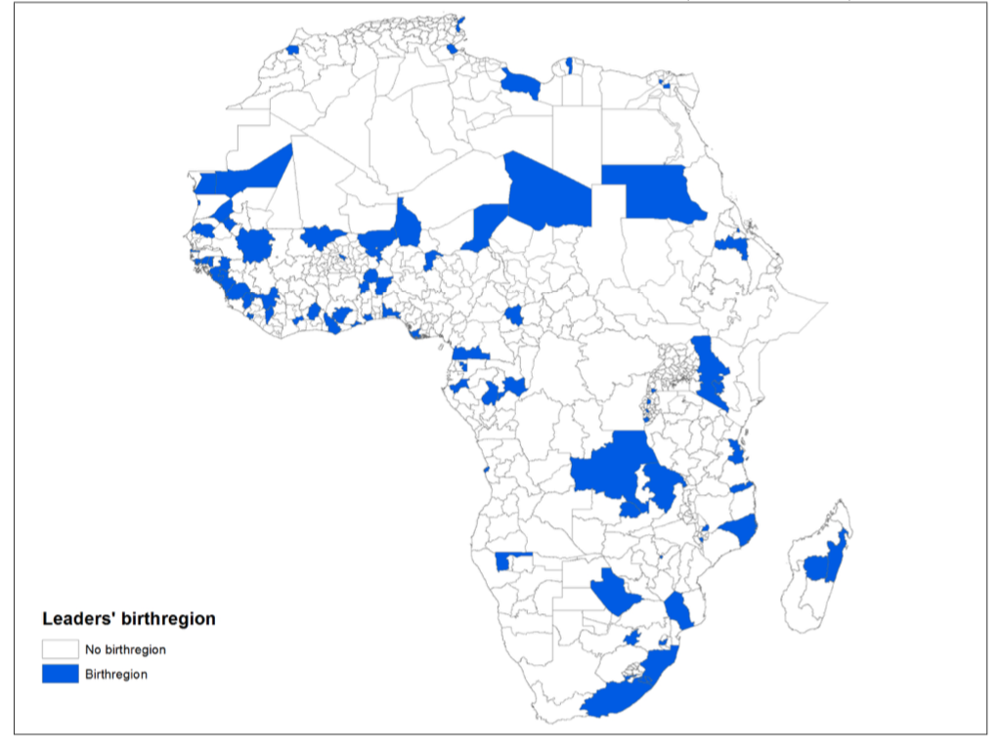

---

## Välkommet bistånd?

- Bidrar till exonomisk utveckling

- Avsaknad av kolonialt bagage  

- Ej paternalistiskt (ex white mans burden)

- Snabba leveranser, bygger projekt som väst inte finansierar 

- Skrivit av stora lån - senast i Kamerun (dock mörkas det)

---

## A Battle for Hearts and Minds? 

Hur påverkar kinesiska biståndsprojekt vad folk tycker och tänker om demokrati?

--

- Auktoritära biståndsprojekt borde bara ha en inverkan om du kommer i kontakt med dem, tex besöker ett sjukhus

--

- Det är mer troligt om du bor nära ett projekt

--

- Givet att folk gillar sjukhus, skolor etc –> positiva attityder

--

- Kinas utvecklingsmodell bra -> Kinesiskt bistånd associerat med lägre stöd för demokrati

---

## A Battle for Hearts and Minds?

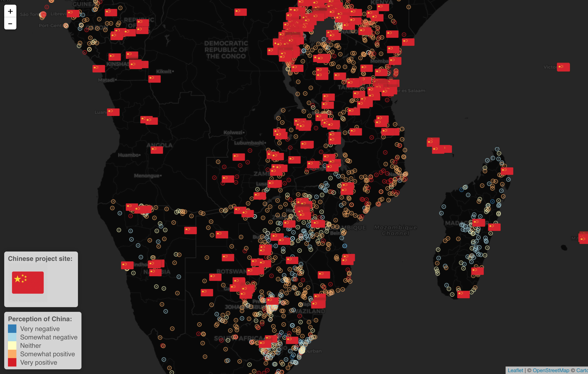

---

## Resultat: a (losing) Battle for Hearts and Minds?

Respondenter som bor nära (inom 50km) kinesiska projekt är: 

- mindre benägna att vara positivt inställda till Kina

- ingen effekt på vad folk tycker om Kinas utvecklingsmodell

- mer benägna att avfärda auktoritära styrelseskick 

---

## Vad är problematiskt med den här studien?

---

## Vad är problematiskt med den här studien?

- Skiljer sig respondenterna åt - selectionseffekter?

- Olika typer av projekt - sjukhus vs motorväg

- Finns det också demokratiska projekt i närheten? 

---

## Biståndsdata
Svenskt bistånd:

- [OpenAid.se](https://openaid.se/aid/2017/)

OECD:

- [OECD Statistics](https://stats.oecd.org/)

Auktoritärt bistånd:

- [Aid Data](https://www.aiddata.org/)

---

## Litteratur 
- Carothers, Thomas. "Democracy aid at 25: Time to choose." Journal of Democracy 26.1 (2015): 59-73.
- Finkel, Steven E., Aníbal Pérez-Liñán, and Mitchell A. Seligson. "The effects of US foreign assistance on democracy building, 1990–2003." World Politics 59.3 (2007): 404-439.
- Li, Xiaojun. "Does Conditionality Still Work? China’s Development Assistance and Democracy in Africa." Chinese Political Science Review 2.2 (2017): 201-220.

Extra:
- Hernandez, Diego. "Are “New” Donors Challenging World Bank Conditionality?." World Development 96 (2017): 529-549.
- Dreher, Axel, et al. "Aid on demand: African leaders and the geography of China's foreign assistance." (2016).
